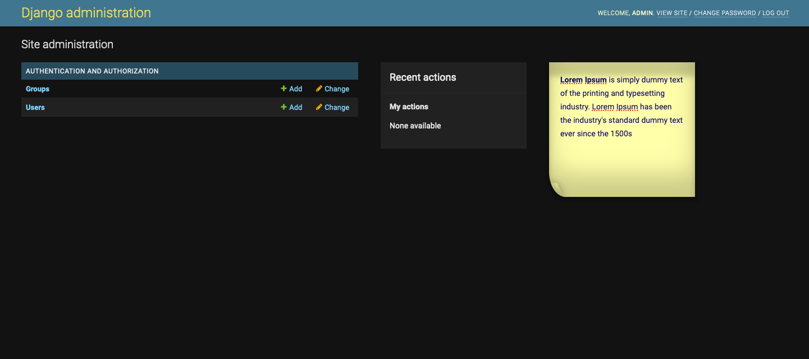

# django_admin_sticky_notes

Share notes between superusers.

Installation
------------

Install via pip:
``pip install django_admin_sticky_notes``

Put ``django_admin_sticky_notes`` app in your *INSTALLED\_APPS* **before**
``django.contrib.admin``:

     INSTALLED_APPS = (
        'django_admin_sticky_notes',
        'django.contrib.admin',
        ...
     )
     
Then in your django site urls.py add the following:
    
    urlpatterns = [
        ...
        path("", StickyNoteView.as_view()),
        ...
    ]